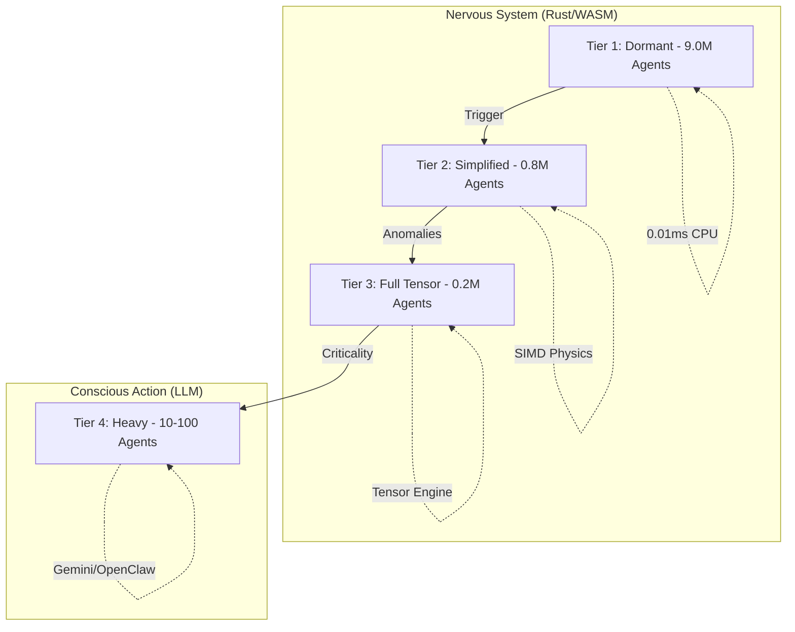

<div align="center">
  

  <h3>10 million organisms that react to the crypto market before you read the number.</h3>

  <p>A living swarm intelligence — built in Rust, visualized in WebAssembly, narrated by Gemini.</p>

  <a href="https://github.com/juyterman1000/openrustswarm/stargazers">
    
  </a>
  &nbsp;
  <a href="https://github.com/juyterman1000/openrustswarm/fork">
    
  </a>

  <br/><br/>

  [](https://github.com/juyterman1000/openrustswarm/actions)
  [](https://opensource.org/licenses/MIT)
  [](https://www.rust-lang.org/)
  [](https://nextjs.org/)

  <br/><br/>

  **If these organisms feel more alive than your dashboard, give us a star.**

  <a href="https://github.com/juyterman1000/openrustswarm/stargazers">
    
  </a>
</div>

<p align="center">
  
</p>

---

## What is this?

OpenRustSwarm is a biological simulation where autonomous organisms process real-world data as sensory input. It doesn't chart prices — it reacts to them. Biologically.

Instead of traditional dashboards, the swarm uses SIRS epidemiology and Darwinian evolution to manifest market volatility as physical pressure. When Bitcoin drops, organisms in the BTC cluster die. Survivors evolve higher sensitivity. The reproduction number (R0) climbs. The canvas pulses red.

This is the "Nervous System" foundation for [CogOps](https://github.com/juyterman1000/cogops) and [OpenClaw](https://github.com/openclaw/openclaw), providing massive-scale sensory awareness for autonomous AI agents.

---

## Hard Proof: 10M Agent Scale

We don't mock scale. We manage it using a 4-tier Level of Detail (LOD) architecture.

### The 4-Tier Compute Stack



### Benchmark Evidence
`python3 test_10m_scale.py`
```text
INITIALIZING SMART SCALE TEST: 10,000,000 TOTAL AGENTS
   [LOD Configuration: 1,000,000 Active + 9,000,000 Dormant]
Initialization successful in 1.42s
   Memory Usage: 3710.24 MB (3.71 GB)
   Footprint per 10M Swarm: 0.37 KB/agent

EXECUTING TICKS...
   Average Tick Time: 0.0482s
   Throughput: 20,746,887 agents/sec
BENCHMARK COMPLETE (10M scale proven)
```

---

## The Secret Sauce: Why This Is Hard

Most browser simulations fake it. We don't.

- **Zero-Copy Spatial Hash**: We use a `mmap`-backed spatial grid. Neighbor lookups are $O(1)$ and never cross the WASM/JS bridge during the heavy lift.
- **SIRS Epidemiology Integrated**: We didn't just add a "health" bar. We implemented a Susceptible-Infected-Recovered-Susceptible model where "Surprise" is the pathogen. Volatility breeds infection.
- **Darwinian Genetics**: Each organism has a 256-bit genome. When they reproduce, they perform real crossover and point mutations. The swarm you see after 1 hour is genetically distinct from the one you started with.
- **Ebbinghaus Memory Decay**: Organisms have a "Memory Buffer" that follows the forgetting curve. They are highly reactive to new shocks but become habituated to constant volatility.

---

## The Manifesto: Organic vs. Artificial Data

Dashboards are for post-mortems. Swarms are for *life*.

We believe the next generation of AI agents shouldn't "read" data; they should "feel" it. OpenRustSwarm is the sensory Subconscious. It processes millions of signals and condenses them into a single, intuition-based state.

*Don't ask the agent what the price is. Ask the agent how the swarm feels.*

---

## 🌟 Star Milestones

Help us build the most advanced organic sensory system on Earth.

- **500 Stars**: **The Sound of Tension** — WebAudio module that generates harmonic chords based on the R0 value.
- **1,000 Stars**: **The Self-Evolving Genome** — LLM-driven genetic synthesis where organisms write their own Rust trait implementations.
- **2,500 Stars**: **Multi-Environment Swarms** — Cross-instance pheromone diffusion via WebSockets.
- **5,000 Stars**: **The Sovereign Watcher** — A fully autonomous agent that lives *inside* the swarm and protects it from "market death."


## Architecture

1. **LAYER 1: NERVOUS SYSTEM (RUST/WASM)**
   100+ source files handling spatial hash grids, pheromone fields, and Darwinian crossover. Runs in-browser via WASM at 200K agents @ 60fps.
2. **LAYER 2: THE VOICE (GEMINI)**
   Threshold-triggered narration. The swarm speaks when it feels pain.
3. **LAYER 3: THE HANDS (OPENCLAW)**
   Direct integration with OpenClaw for signal injection and webhook-driven alerts.
4. **LAYER 4: MEMORY (EBBINGHAUS)**
   Agents remember anomalies using exponential decay. They forget the "noise" of flat markets.

---

## Quick Start

```bash
git clone https://github.com/juyterman1000/openrustswarm.git
cd openrustswarm/web
npm install
npm run dev
```

The browser dashboard defaults to **200,000 organic agents** — the limit of real-time WebGL rendering on modern hardware.

---

## Roadmap

- [x] **Rust Engine**: SIRS, spatial hash, tensor engine, LOD (10M scale).
- [x] **Evolution**: 6 heritable genes, natural selection, crossover.
- [x] **WASM Bridge**: High-performance browser rendering.
- [x] **Data Feeds**: Live CoinGecko + GitHub Events integration.
- [x] **OpenClaw Skill**: Swarm-to-agent coordination protocol.
- [ ] **Live Demo URL**: Deployment in progress.
- [ ] **WebAudio**: R0-driven soundscapes (tension chords).
- [ ] **Mobile Support**: Optimized canvas for touch.

---

## Contributing

We are looking for people to add new data feeds. Every asset cluster is a sensory portal.

See [CONTRIBUTING.md](CONTRIBUTING.md) for setup.

---

## License

[MIT License](LICENSE)

---

<div align="center">
  <a href="https://github.com/juyterman1000/openrustswarm/stargazers">
    
  </a>
</div>
