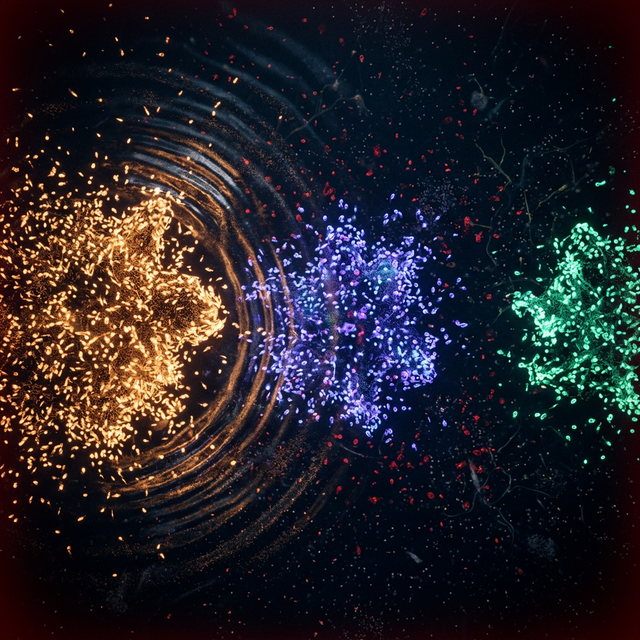

<div align="center">
  

  <h3>50,000 organisms that feel the crypto market before you do.</h3>

  <p>A living swarm intelligence — built in Rust, visualized in WebAssembly, narrated by Gemini.<br/>
  It doesn't chart prices. It <em>reacts</em> to them. Biologically.</p>

  [](https://opensource.org/licenses/ISC)
  [](https://www.rust-lang.org/)
  [](https://nextjs.org/)
  [](https://github.com/juyterman1000/openrustswarm)
</div>

<p align="center">
  
</p>

---

## What is this?

OpenRustSwarm is a biological simulation where **thousands of autonomous organisms** process real-world data as sensory input. Each organism has:

- 🧬 **6 heritable genes** — transfer rate, recovery rate, infection radius, broadcast power, sensitivity, mutation rate
- 🦠 **SIRS epidemiology** — organisms infect each other with "surprise" when anomalies hit
- 🧠 **Ebbinghaus memory decay** — they remember shocking events, forget routine ones
- ⚡ **Spatial hash grid** — O(1) neighbor lookups, real physics, not random
- 🧪 **Darwinian evolution** — natural selection, crossover, mutation every generation
- 🌫️ **6-channel pheromone field** — danger, trail, food, novelty, alarm, reward

When Bitcoin drops 3%, you don't read a number — you **see the organisms die**. The survivors evolve. R₀ climbs. The swarm fights back.

### The one question that matters:

> *When something real happens — BTC drops 3%, a DeFi repo spikes — can you see it in the organisms before you read the number?*

**Yes. That's the point.**

---

## Quick Start

```bash
# Clone
git clone https://github.com/juyterman1000/openrustswarm.git
cd openrustswarm

# Start the dashboard
cd web
npm install
npm run dev
# → http://localhost:3000
```

You need a `GEMINI_API_KEY` in `web/.env.local` for the narration voice:

```env
GEMINI_API_KEY=your_key_here
```

Without it, the swarm still runs — it just can't speak.

---

## Architecture

```
┌─────────────────────────────────────────────────────────────┐
│                    LAYER 5: THE FACE                        │
│   Next.js dashboard, WebGL/Canvas2D, crypto ticker,         │
│   R₀ tension overlay (red pulse when R₀ > 1.2)             │
├─────────────────────────────────────────────────────────────┤
│                    LAYER 4: MEMORY                          │
│   Ebbinghaus decay, metacognition, curiosity module         │
├─────────────────────────────────────────────────────────────┤
│                    LAYER 3: THE HANDS                       │
│   OpenClaw skill, webhook alerts, signal injection API      │
├─────────────────────────────────────────────────────────────┤
│                    LAYER 2: THE VOICE                       │
│   Gemini 2.5 Flash narration — speaks as the organism       │
│   "847 organisms near the BTC cluster just died."           │
├─────────────────────────────────────────────────────────────┤
│                    LAYER 1: NERVOUS SYSTEM                  │
│   100+ Rust source files, WASM bridge, 10M agent engine     │
│   SIRS, evolution, pheromones, spatial hash, safety shield   │
└─────────────────────────────────────────────────────────────┘
```

## Real Data Feeds

The swarm ingests live data every 15 seconds:

| Feed | Source | What organisms feel |
|------|--------|-------------------|
| **BTC** | CoinGecko | Shockwave in left swarm region |
| **ETH** | CoinGecko | Shockwave in center region |
| **SOL** | CoinGecko | Shockwave in right region |
| **GitHub** | Events API | Activity pulse in center |

Each asset has its own organism cluster. Inter-poll price deltas (not 24h averages) drive reactions — a $200 BTC move in 15 seconds creates visible cascading shockwaves.

---

## Performance

| Metric | Value |
|--------|-------|
| Max agents | **10,000,000** |
| Per-tick cost | **$0.00** (no LLM in the loop) |
| Memory @ 10M | **3.71 GB** |
| Throughput | **20.5M agent-updates/sec** |
| Latency | **< 0.1ms** per tick |
| Architecture | Struct-of-Arrays (cache-friendly) |

Benchmarks are reproducible on consumer hardware. No cloud required.

---

## Project Structure

```
openrustswarm/
├── openrustswarm-core/    # Rust engine — 100+ source files
│   └── src/
│       ├── swarm/         # SIRS, spatial hash, tensor engine, LOD, mmap
│       ├── evolution/     # Population genetics, sandbox, synthesizer
│       ├── worldmodel/    # Pheromone diffusion, memory consolidation
│       ├── compliance/    # Safety shield, audit trails
│       └── core/          # Workflow, graph orchestration
├── cogops-wasm/           # WASM bridge for browser rendering
├── web/                   # Next.js dashboard
│   ├── app/api/           # 9 API routes (feeds, narration, OpenClaw)
│   ├── hooks/             # useWasmEngine, useNarration, useRealDataFeed
│   ├── components/swarm/  # AgentCanvas, R0Indicator, NarrationPanel
│   └── lib/               # WebGL renderer, color maps, ring buffers
├── cogops-skill/          # OpenClaw integration skill
├── server/                # Python server + swarm brain
├── demo/                  # Demo server
└── examples/              # Python usage examples
```

---

## Contributing

We want contributors. Here's how:

### Good First Issues

- **Add a new data feed** — plug in any API (DeFi TVL, earthquake data, social media sentiment) as a new sensory input. See `web/app/api/feeds/` for the pattern.
- **New color mode** — the swarm supports custom color maps. Add one in `web/lib/color-maps.ts`.
- **Narration personality** — swap the narrator's voice in `web/app/api/swarm/narrate/route.ts`. Make it a war correspondent, a poet, or a sports commentator.

### Bigger Projects

- **Sound design** — R₀ > 1.0 should SOUND tense. Add WebAudio.
- **Mobile dashboard** — responsive layout for the swarm viewer.
- **New organism subsystems** — add a 7th pheromone channel, a new gene, or a new evolutionary pressure.
- **More data feeds** — stock indices, weather, earthquake data, Twitch chat velocity.

### How to Contribute

1. Fork the repo
2. Create a feature branch (`git checkout -b feat/earthquake-feed`)
3. Make your changes
4. Run `npx next build` in `web/` to verify
5. Open a PR

---

## API Routes

| Route | Method | Purpose |
|-------|--------|---------|
| `/api/swarm` | GET | Live swarm metrics |
| `/api/swarm/narrate` | POST | Gemini narration |
| `/api/feeds/crypto` | GET | BTC/ETH/SOL prices |
| `/api/feeds/github` | GET | GitHub activity |
| `/api/openclaw/push` | POST | Forward alerts to OpenClaw |
| `/api/openclaw/inject` | POST/GET | Inject signals into swarm |

---

## The 5 Layers

| Layer | Name | Status |
|-------|------|--------|
| 1 | **Nervous System** — Rust engine, SIRS, evolution, pheromones | ✅ Live |
| 2 | **The Voice** — Gemini narrates as the organism | ✅ Live |
| 3 | **The Hands** — OpenClaw integration for autonomous actions | ✅ Built |
| 4 | **Memory** — Ebbinghaus decay, metacognition | ✅ Active |
| 5 | **The Face** — Dashboard, crypto ticker, R₀ tension overlay | ✅ Live |

---

## License

[ISC License](LICENSE) — use it, fork it, build on it.

---

<div align="center">
  <sub>Built with Rust, WebAssembly, and the belief that organisms are better than dashboards.</sub>
</div>
